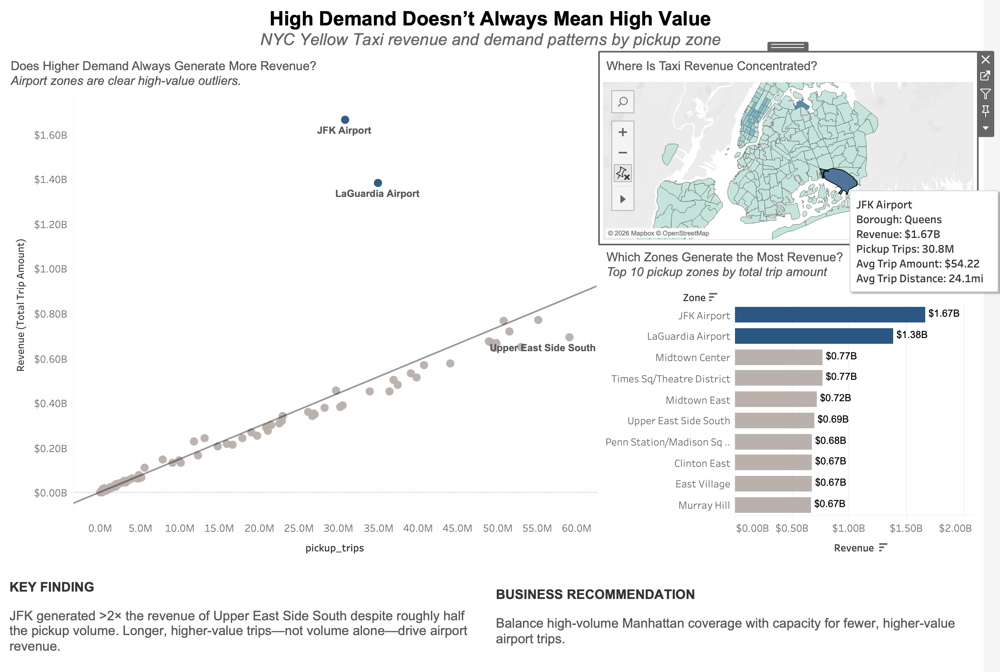
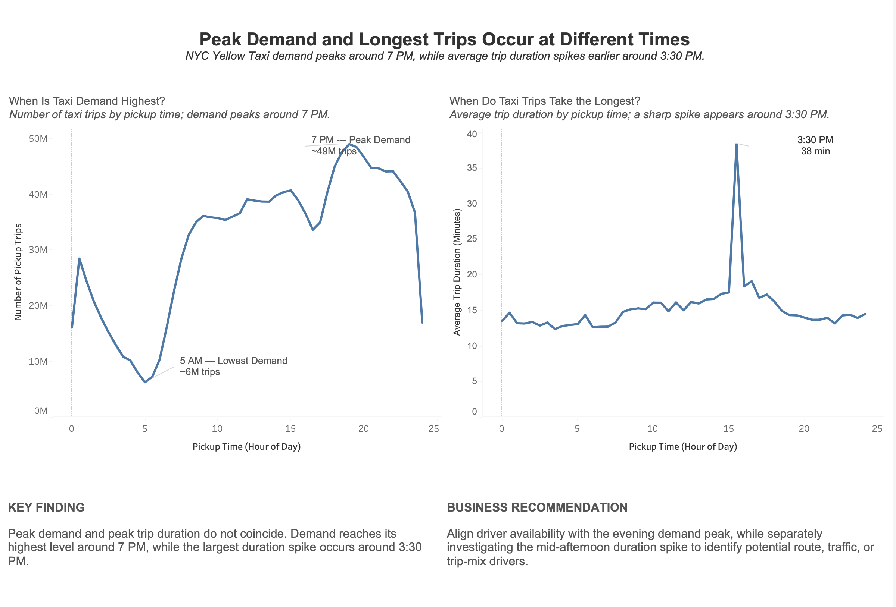
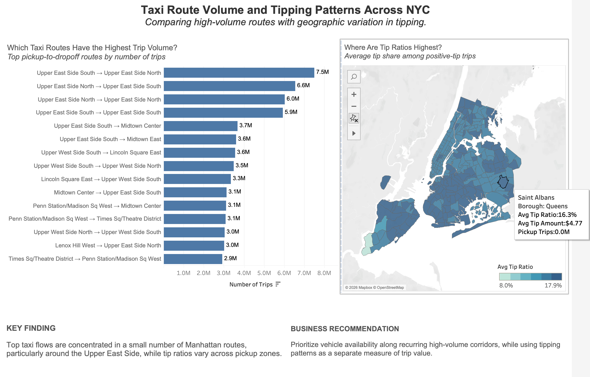

# NYC Taxi Revenue & Demand Analysis

An end-to-end data analytics project exploring NYC Yellow Taxi demand, revenue, trip duration, route patterns, and tipping behavior using **Google BigQuery, Python, SQL, and Tableau**.

The project analyzes historical NYC Yellow Taxi trip data to answer a practical business question:

> **How can taxi demand, trip value, time-of-day patterns, and passenger flows inform better vehicle allocation decisions?**

---

## Project Overview

Taxi demand is not equally valuable across locations or time periods. High trip volume may generate frequent rides, while lower-volume areas can produce substantially higher-value trips.

This project analyzes taxi activity from multiple perspectives:

- Where are taxi demand and revenue concentrated?
- Does higher trip volume always generate higher revenue?
- When is taxi demand highest?
- Do peak demand and longest trip duration occur at the same time?
- Which pickup-to-dropoff routes have the highest trip volume?
- How do tipping patterns vary geographically?

The analysis moves from raw NYC taxi trip records to aggregated datasets and interactive Tableau dashboards designed to translate the data into operational insights.

---

## Tools & Technologies

- **Google BigQuery / SQL** — querying and aggregating large-scale NYC taxi trip data
- **Python** — data processing, validation, and preparation
- **Pandas / GeoPandas** — tabular and geospatial data transformation
- **Tableau** — visualization and dashboard development
- **Git / GitHub** — project organization and version control

---

## Data Source

The analysis uses the NYC Yellow Taxi dataset available through Google BigQuery:

`bigquery-public-data.new_york_taxi_trips`

The project analyzes historical Yellow Taxi trips prior to 2025 and applies basic data-quality filters such as valid passenger counts, positive trip duration, and metric-specific value filters.

Because the raw dataset contains more than one billion trip records, SQL aggregation was performed in BigQuery before visualization.

---

# Dashboard 1 — Revenue & Demand

## High Demand Doesn't Always Mean High Value



This dashboard compares pickup demand with total trip revenue across NYC taxi zones.

### Key Finding

Airport zones are clear high-value outliers.

**JFK Airport generated more than twice the revenue of Upper East Side South despite roughly half the pickup volume.**

This suggests that trip volume alone does not determine the financial value of a taxi market. Longer, higher-value airport trips can generate substantially more revenue with fewer pickups.

### Business Recommendation

Balance high-volume Manhattan coverage with capacity for fewer, higher-value airport trips.

Rather than allocating vehicles based only on trip volume, fleet planning should consider both **demand frequency and trip value**.

---

# Dashboard 2 — Time-of-Day Patterns

## Peak Demand and Longest Trips Occur at Different Times



This dashboard compares taxi pickup demand with average trip duration throughout the day.

### Key Finding

Taxi demand peaks around **7 PM**, while the largest average trip-duration spike occurs earlier, around **3:30 PM**.

Peak demand and peak trip duration therefore do not coincide.

This indicates that demand volume and trip-time pressure represent different operational patterns and should not automatically be treated as the same problem.

### Business Recommendation

Align driver availability with the evening demand peak while separately investigating the mid-afternoon duration spike before making operational changes.

---

# Dashboard 3 — Routes & Tipping

## Taxi Route Volume and Tipping Patterns Across NYC



This dashboard examines high-volume pickup-to-dropoff routes alongside geographic variation in tipping.

### Key Finding

Top taxi flows are concentrated in a relatively small number of Manhattan routes, particularly around the **Upper East Side**.

At the same time, tip ratios vary across pickup zones, showing that passenger flow and tipping behavior represent different dimensions of market activity.

### Business Recommendation

Prioritize vehicle availability along recurring high-volume corridors while using tipping patterns as a separate measure of trip value.

---

## Analysis Workflow

The project follows an end-to-end analytics workflow:

1. Queried NYC Yellow Taxi trip records using **BigQuery SQL**
2. Applied data-quality filters to remove invalid or unusable records
3. Aggregated trip metrics by:
   - pickup zone
   - time of day
   - pickup-to-dropoff route
4. Calculated revenue, trip volume, trip duration, trip distance, and tipping metrics
5. Joined taxi-zone geographic information for spatial analysis
6. Exported analysis-ready CSV and GeoJSON datasets
7. Built three Tableau dashboards
8. Translated visualization findings into business recommendations

---

## Key Metrics

| Metric | Definition |
|---|---|
| Pickup Trips | Number of taxi trips originating in a pickup zone |
| Revenue | Sum of total trip amount |
| Avg Trip Amount | Average total amount per qualifying trip |
| Avg Trip Duration | Average minutes between pickup and dropoff |
| Avg Trip Distance | Average trip distance |
| Avg Tip Amount | Average tip amount among qualifying positive-tip trips |
| Avg Tip Ratio | Average tip as a share of total trip amount among positive-tip trips |

---

## Repository Structure

```text
nyc-taxi-revenue-demand-analysis/
│
├── data/
│   ├── taxi_zone_metrics.geojson
│   ├── trips_by_time_of_day.csv
│   ├── duration_by_time_of_day.csv
│   └── top_pickup_dropoff_routes.csv
│
├── processing/
│   └── preprocess.ipynb
│
├── images/
│   ├── dashboard_1_revenue_demand.png
│   ├── dashboard_2_time_patterns.png
│   └── dashboard_3_routes_tipping.png
│
├── nyc_taxi_analysis.twbx
│
└── README.md
